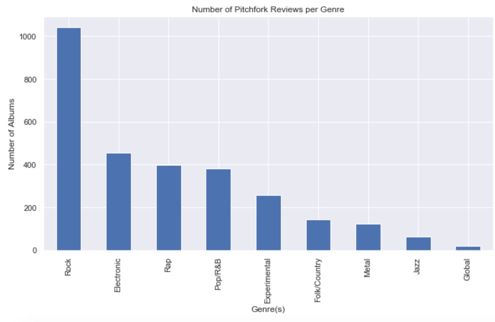
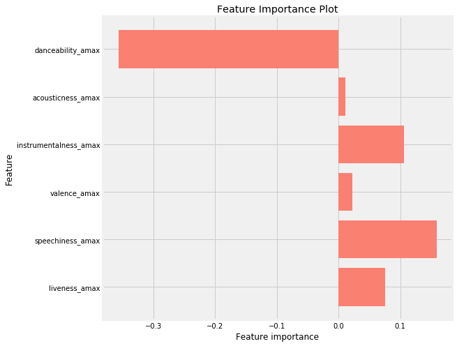
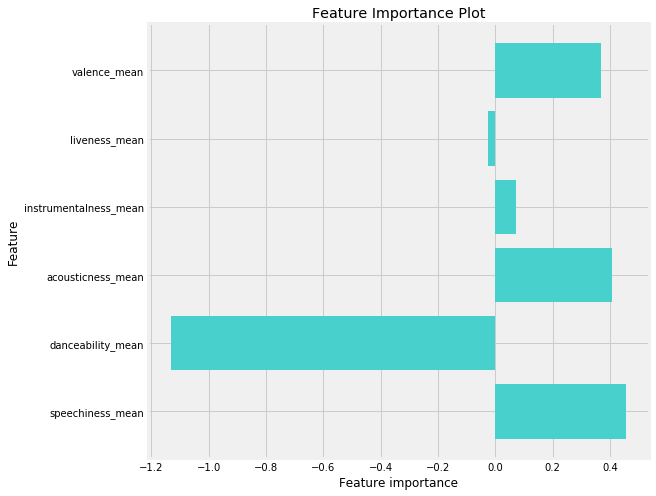

# Album Score Prediction

## Project Summary

This project aims to predict the key characteristics of what makes an album a critical success, in order to help aspiring musicians improve their chances of breaking through.
The information on the characteristics was retrieved through Spotify's own method of evaluation. While these metrics may seem a bit arbitrary, it's one of the few methods of quantifying some key musical characteristics, and the abundance of information (directly proportionate to the quantity of music available on the platform) makes it perfect for a study on what makes a song successful.
The information on album rating was obtained with Pitchfork's reviews, rating albums on a scale of 0 to 10. Pitchfork began as an online indie music magazine but now reviews mainstream music as well.

## Contents of the repository

This repository contains 5 notebooks with the following contents:

- Pitchfork Webscraping
- Spotify API Calls
- Data Cleaning
- Exploratory Data Analysis
- Modeling for Predicting Pitchfork Score

The dataset was created by scraping album scores from Pitchfork and audio features retrieved through Spotify's API.

Pitchfork review page: https://pitchfork.com/reviews/albums/
Spotify API page: https://developer.spotify.com/documentation/web-api/

## Pitchfork Reviews

Pitchfork was created in 1997 as a website for reviews on indie music. Since then, estabilished itself as one of the most renowned platform for music reviews, and expanding its area of coverage to mainstream music and niche subcultures. I decided to use their metric of evaluation due to the popularity of the platform, where extreme reviews (both positive and negative) generate a lot of discussion, increasing the popularity and the status of an album in case of a high score.

## Audio Features

Spotify uses a relatively sophisticated set of original values along with traditional ones (such as key and tempo) to describe every song on the platform. The features are the following:

- duration_ms: The duration of the track in milliseconds.
- key:	The estimated overall key of the track. Integers map to pitches using standard Pitch Class notation . E.g. 0 = C, 1 = C♯/D♭, 2 = D, and so on. If no key was detected, the value is -1.
- mode:	Mode indicates the modality (major or minor) of a track, the type of scale from which its melodic content is derived. Major is represented by 1 and minor is 0.
- time_signature: An estimated overall time signature of a track. The time signature (meter) is a notational convention to specify how many beats are in each bar (or measure).
- acousticness: A confidence measure from 0.0 to 1.0 of whether the track is acoustic. 1.0 represents high confidence the track is acoustic.
- danceability: Danceability describes how suitable a track is for dancing based on a combination of musical elements including tempo, rhythm stability, beat strength, and overall regularity. A value of 0.0 is least danceable and 1.0 is most danceable.
- energy: A measure from 0.0 to 1.0 and represents a perceptual measure of intensity and activity. Typically, energetic tracks feel fast, loud, and noisy.
- instrumentalness: Predicts whether a track contains no vocals. The closer the instrumentalness value is to 1.0, the greater likelihood the track contains no vocal content.
- liveness: Detects the presence of an audience in the recording. Higher liveness values represent an increased probability that the track was performed live.
- loudness: The overall loudness of a track in decibels (dB). Loudness values are averaged across the entire track and are useful for comparing relative loudness of tracks.
- speechiness: Speechiness detects the presence of spoken words in a track. The more exclusively speech-like the recording (e.g. talk show, audio book, poetry), the closer to 1.0 the attribute value.
- valence: A measure from 0.0 to 1.0 describing the musical positiveness conveyed by a track.
- tempo: The overall estimated tempo of a track in beats per minute (BPM).

## Data Science Process

The process used is the standard CRISP-DM process:

1) Business understanding

As previously mentioned, this study aims to help musicians understand their chances of success with a novel method of music analysis that combines subjective opinions - the Pitchfork reviews - with Spotify's metrics to achieve a more comprehensive and reliable prediction of success.

2) Data understanding and preparation

The data comes in two sets: the Spotify audio features embedded in the platform and the album reviews from Pitchfork. Due to a disproportion between the sets of multiple songs per album, I decided to approach the problem by creating two sets of audio features per album: a set with the mean of the values for every song in an album and a set with the max value of a song for an album, and test to see which value yield the best results. I decided to focus the research on Rock albums exclusively as they make up the largest group of albums that share comparable characteristics. Mixing genres would have created noise in the modeling.

3) Modeling

I've decided to use the following variables as predictors:

* Speechiness
* Danceability
* Acousticness
* Valence
* Liveness
* Instrumentalness

Other variables such as tempo, mode and key are deliberately excluded to avoid suggesting an overly formulaic approach in song making, since a repetitive album is a guaranteed failure. The values chosen will instead point towards more general characteristics while giving musicians greater artistic freedom.

The models used are regression models that will give in result a score that tells the influence of the selected features on the target variable. For this study, I decided to use a regular linear regression model to see if there's a general influence from the features selected and a Ridge regression to minimise the influence of features closer to zero. 

4) Evaluation and Deployment

I chose a standard Linear Regression as a baseline model, and a Ridge Regression model due to the regularised nature of the predictive variables and to minimise multicollinearity. The performance of the models on training and validation wasn’t stellar, with R2 scores never exceeding 2% for both models on both mean and max sets. Parameter optimization through GridsearchCV increased results to about 3% on test and validation sets, with Ridge having a slight advantage over the baseline LR. It was now time to carry out the real test and see the results.

On test sets, the optimized Ridge gave a R2 of 5% on the means, and about 2% on the max. This on its own may sound a little disappointing, but a quick visualization of the coefficients helped get better information.

 

## Conclusions and future improvements

The resulting r2 is relatively low, but we're still able to see which features influence the most a critic's score. Definitely don't make your album too danceable and focus a little more on lyricism. There's a bit of inconsistency with valence and acousticness between values: while the album should be overall positive and with acoustic instruments, it seems it doesn't influence a lot the individual songs. It's also worth noting that Max features have a significantly smaller influence than mean values.

As it stands, we don't have enough points of reference to see if the model actually reflects the trends of the genres it's fitted on. I simply advise gathering enough data to create more models to fit on different genres and try different regression methods to see if the linear relationship tested best reflects the features influencing the score of an album.

email: vittorioscacchetti1@gmail.com
